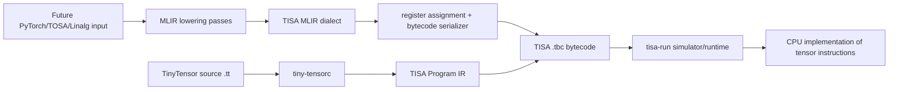

# Architecture

## Why this split matters

The simulator is the executable specification of the imaginary accelerator. The compiler is not allowed to invent semantics; it must lower programs into operations the simulator already defines. Keeping that boundary explicit makes compiler bugs distinguishable from target/runtime bugs.

## MVP target contract

- 64 virtual tensor registers (`r0` ... `r63`).
- Element type: `f32` only.
- Static shapes only.
- Matrix multiply: rank-2 only.
- Bytecode instructions are 8 bytes: opcode, dst, src0, src1, immediate.
- Tensor constants live in a bytecode constant pool.

### Opcodes

| Opcode | Meaning |
|---|---|
| `CONST` | Load a constant-pool tensor into a virtual register. |
| `ADD` | Elementwise add. Shapes must match. |
| `MUL` | Elementwise multiply. Shapes must match. |
| `MATMUL` | Matrix multiply `[M,K] x [K,N] -> [M,N]`. |
| `RELU` | Elementwise `max(x, 0)`. |
| `PRINT` | Simulator-only debug output. |
| `HALT` | Stop execution. |

## What the MLIR layer should become

The included `tisa` dialect is the target-facing IR. The next compiler pass should accept a higher-level tensor dialect (start with `linalg` or TOSA), reject operations/shapes the ISA cannot express, and rewrite supported operations into `tisa.*` operations. A later translation step should assign SSA values to virtual registers and emit the exact same bytecode consumed by `tisa-run`.

Do not add tiling, vectorization, DMA, local SRAM, asynchronous execution, or scheduling until the scalar/simple tensor pipeline works end to end.
